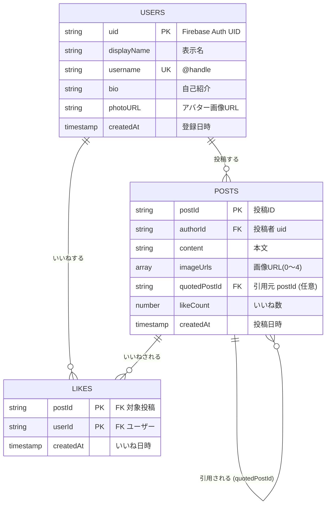

# SNS-app

X(旧Twitter)を参考にした短文投稿型SNSアプリの個人開発プロジェクト。

## 技術スタック

| 区分 | 採用技術 |
|---|---|
| フロントエンド | Next.js(App Router / TypeScript) |
| 認証 | Firebase Authentication |
| データベース | Cloud Firestore |
| ファイルストレージ | Cloud Storage for Firebase |
| ホスティング | Firebase Hosting または Vercel |

## 主な機能(初版)

全機能はログイン済みユーザーのみ利用可能(ユーザー認証は前提)。

- **投稿** — テキスト + 画像(任意・最大4枚)を投稿
- **いいね** — 1ユーザー × 1投稿で1いいね、トグル動作
- **削除** — 自分の投稿のみ削除可
- **プロフィール** — 表示名 / @ユーザー名 / 自己紹介 / アバター、自分のみ編集可
- **引用ポスト** — 既存投稿を引用してコメント付きで投稿
- **画像投稿** — JPEG / PNG / GIF / WebP、最大4枚 / 1ファイル5MBまで

## データモデル(ER図)



## セットアップ

```bash
# 依存関係のインストール
npm install

# 開発サーバー起動
npm run dev
```

Firebase の設定は `.env.local` に記載(プロジェクト作成後に追記予定)。

## 今後追加予定の機能

- フォロー / フォロワー
- リプライ / スレッド表示
- リポスト(引用なし)
- 検索(投稿・ユーザー・ハッシュタグ)
- 通知
- DM
- ブックマーク
- 投稿編集
- ミュート / ブロック

## 未確定事項

- 文字数上限(暫定: 280文字)
- 画像最大枚数・サイズ(暫定: 4枚 / 5MB)
- 未ログインユーザーの閲覧可否
- 認証方式(メール / Google / 両方)
