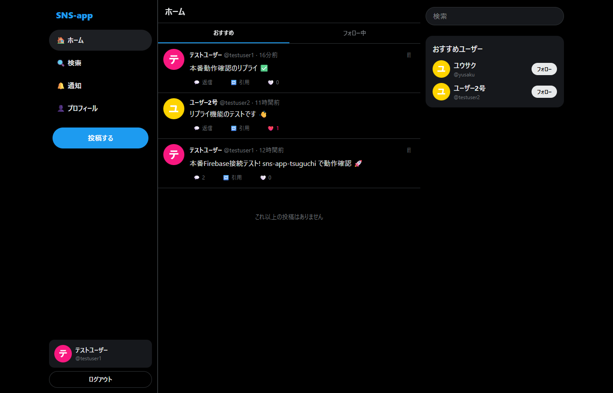
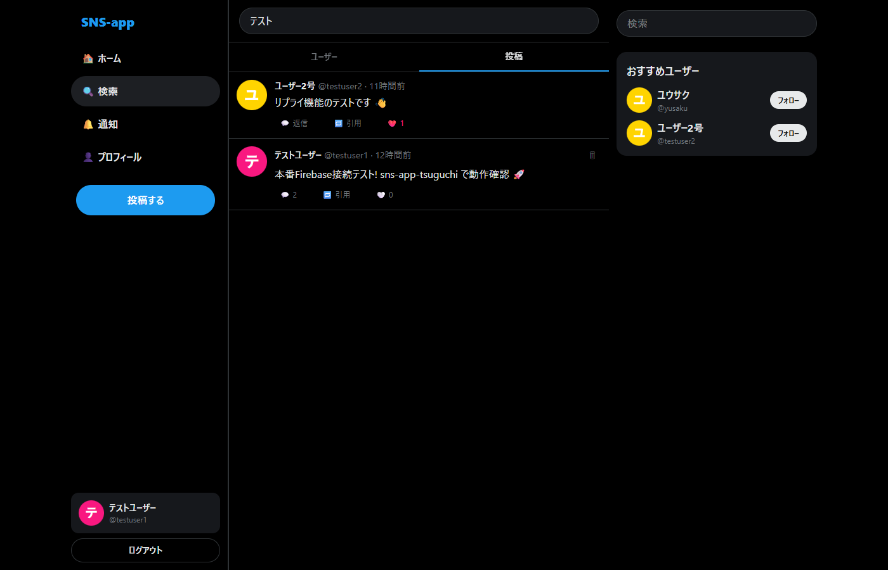
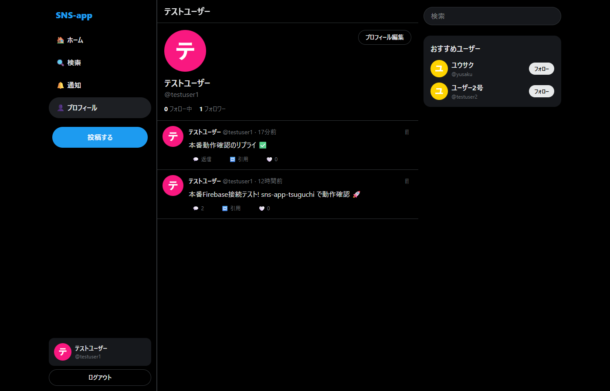
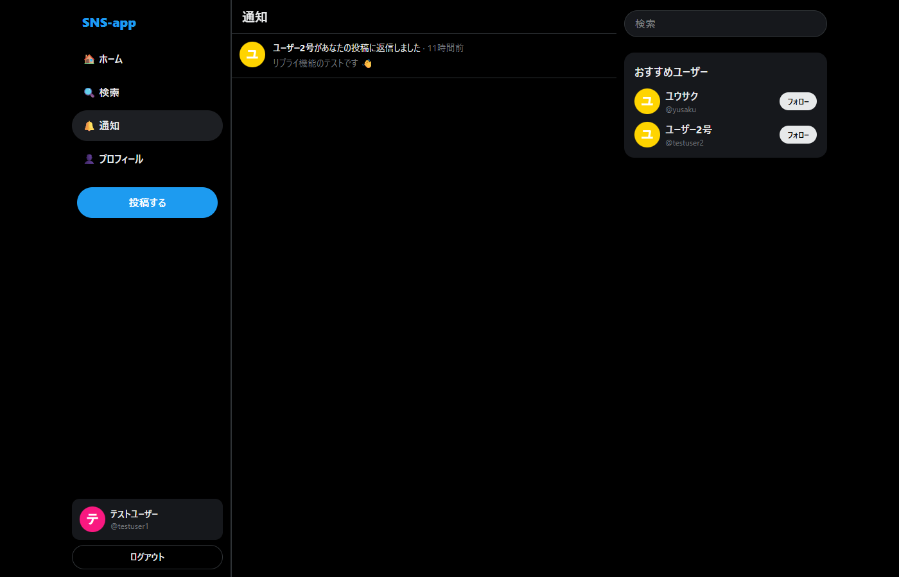
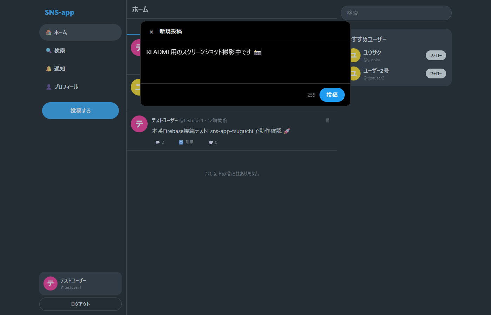
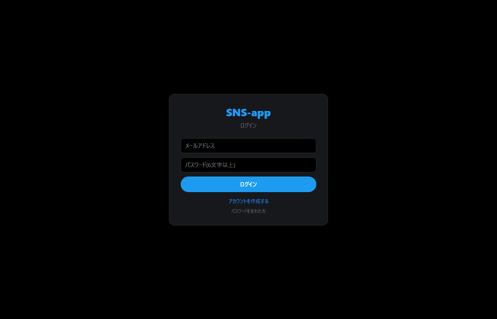
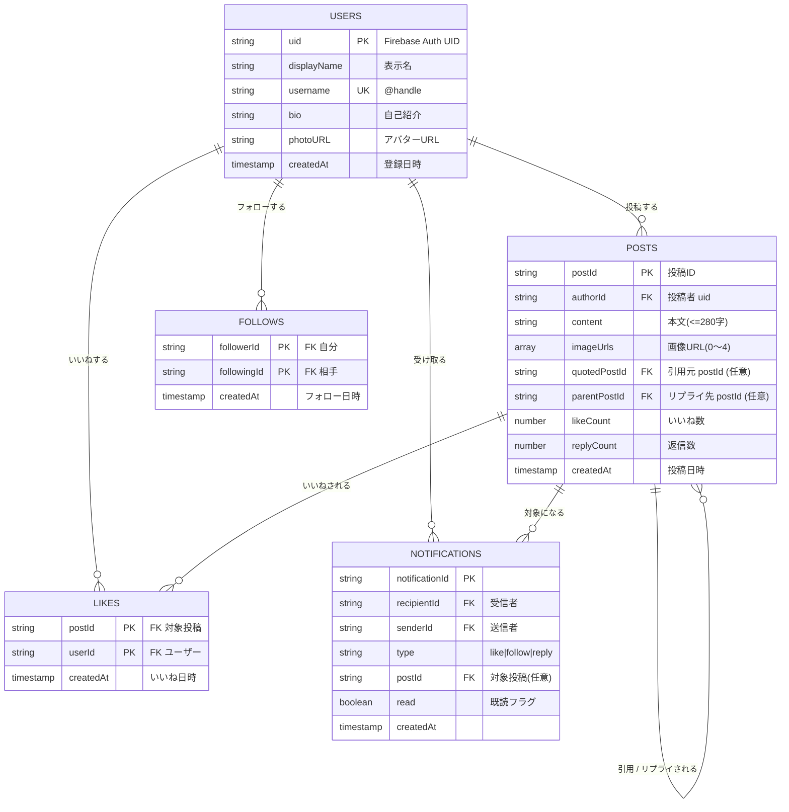

# SNS-app

X(旧Twitter)風の短文投稿型 SNS アプリ。Next.js 16 + Firebase で個人開発したフルスタックプロジェクト。

🚀 **本番デモ**: https://sns-app-ashy.vercel.app/

---

## スクリーンショット

### ホーム(3カラムレイアウト)
タイムライン + 「おすすめ / フォロー中」タブ + 右ペインに検索ショートカットとおすすめユーザー。


### 検索
ユーザー(username/displayName 前方一致)と投稿(部分一致)を切替検索。


### プロフィール
表示名・自己紹介・アバター・フォロー数/フォロワー数・投稿一覧。自分のプロフィールには「プロフィール編集」、他人には「フォロー」ボタン。


### 通知
いいね / フォロー / リプライの通知をリアルタイム購読。表示時に自動既読化。


### 投稿モーダル
新規投稿 / 引用ポスト / リプライの3モードを共通コンポーネントで実装。280字カウンタと画像アップロードUI(機能フラグでON/OFF可能)。


### ログイン / サインアップ
メール+パスワード認証 + パスワードリセット導線。


---

## 機能一覧

| カテゴリ | 機能 |
|---|---|
| 認証 | メール+パスワード サインアップ / ログイン / パスワードリセット |
| 投稿 | テキスト投稿(280字制限)/ 画像投稿(任意・最大4枚 5MB)/ 自分の投稿のみ削除 |
| インタラクション | いいね(楽観的UI)/ 引用ポスト / リプライ(スレッド表示) |
| ソーシャルグラフ | フォロー / フォロワー(自己フォロー禁止)/ 「フォロー中」タイムライン |
| 検索 | ユーザー前方一致 / 投稿部分一致(最新200件) |
| 通知 | いいね・フォロー・リプライ通知 + 未読バッジ + 自動既読化 |
| プロフィール | 表示名 / @handle / 自己紹介 / アバター画像 / 自分のみ編集可 |

## 技術スタック

| 区分 | 採用技術 |
|---|---|
| フロントエンド | Next.js 16(App Router)/ TypeScript / Tailwind CSS v4 / React 19 |
| 認証 | Firebase Authentication |
| データベース | Cloud Firestore |
| ファイルストレージ | Cloud Storage for Firebase(機能フラグで切替可能) |
| ホスティング | Vercel(GitHub 連携で main 自動デプロイ) |
| 開発ツール | Firebase Emulator Suite(Auth / Firestore / Storage / UI)|

---

## データモデル(ER図)



---

## セットアップ(ローカル開発)

### 前提
- Node.js 20+
- Java JRE(Firebase Emulator 用)
- Firebase CLI(`npx firebase` で利用)

### 1) 依存関係のインストール
```bash
npm install
```

### 2) `.env.local` を作成
```bash
cp .env.local.example .env.local
# 既定値はエミュレーター接続用のダミー
```

### 3) Firebase Emulator Suite を起動(別ターミナル)
```bash
npm run emulators
```
Auth / Firestore / Storage / UI が起動します。UI は http://127.0.0.1:4000

### 4) シードデータ投入(初回のみ)
```bash
npm run seed
```
3 ユーザー(alice / bob_dev / carol、パスワードはすべて `password`)+ 3 投稿 + 1 いいね が入ります。

### 5) Next.js dev サーバー
```bash
npm run dev
```
http://localhost:3000

本番 Firebase に接続したい場合は [docs/firebase-setup.md](docs/firebase-setup.md) を参照。

---

## プロジェクト構成

```
.
├── app/
│   ├── (main)/                   # 認証必須レイアウト(サイドバー + 右ペイン)
│   │   ├── layout.tsx
│   │   ├── page.tsx              # ホーム(タイムライン)
│   │   ├── notifications/
│   │   ├── post/[id]/            # 投稿詳細(リプライスレッド)
│   │   ├── profile/[username]/
│   │   ├── profile/edit/
│   │   └── search/
│   ├── login/
│   ├── forgot-password/
│   ├── layout.tsx                # AuthProvider
│   └── globals.css               # Tailwind + ダークテーマ
├── components/
│   ├── AuthProvider.tsx
│   ├── ComposerProvider.tsx      # 投稿モーダルの開閉を全ページから制御
│   ├── PostCard.tsx              # 投稿カード(memo + 楽観的UI)
│   ├── PostComposer.tsx          # 新規/引用/リプライの3モード
│   ├── RightPane.tsx             # 検索 + おすすめユーザー
│   └── Sidebar.tsx
├── lib/
│   ├── firebase.ts               # SDK 初期化(エミュレーター自動接続)
│   ├── posts.ts                  # createPost / deletePost / toggleLike
│   ├── follows.ts
│   ├── notifications.ts
│   ├── search.ts
│   ├── storage.ts
│   ├── users.ts                  # fetchUsersByUids でバッチ読み取り
│   ├── featureFlags.ts           # NEXT_PUBLIC_STORAGE_ENABLED
│   ├── useUserLikes.ts
│   ├── useFollowing.ts
│   └── useUnreadNotifications.ts
├── docs/
│   ├── 要件定義書.md              # 要件定義 + ER図 + 将来機能候補
│   ├── firebase-setup.md         # 本番接続手順
│   └── screenshots/              # README 用スクショ
├── prototype/                    # HTML/CSS/JS の初期プロトタイプ(参考)
├── scripts/seed.ts               # Emulator 用シーダー
├── firebase.json
├── firestore.rules               # ルール定義
├── firestore.indexes.json
└── storage.rules
```

---

## 開発履歴(Phase別)

| Phase | 内容 | PR |
|---|---|---|
| 1 | Next.js + Firebase 初期化、認証、タイムライン読み取り | #1 |
| 2 | 投稿作成 / いいね(トランザクション)/ 自分の投稿削除 | #2 |
| 3 | プロフィール / 引用ポスト / 画像投稿 | #4 |
| 4 | 本番 Firebase 接続 + Storage 機能フラグ | #5 / #6 |
| 5 | フォロー / フォロワー + フォロー中タイムライン | #7 / #8 |
| 6 | リプライ / 検索 / 通知 / パスワードリセット | #9 / #10 |
| 7 | パフォーマンス改善(N+1解消・無限スクロール・楽観的UI・React.memo) | #11 / #12 |
| 8 | X風3カラムレイアウト(右ペイン) | #13 / #14 |

---

## パフォーマンス指標

| 項目 | 値 |
|---|---|
| いいねクリック→視覚反映 | ~50ms(楽観的UI) |
| タイムライン50件取得時のFirestore RTT | 1〜数回(`where(documentId, 'in')` でバッチ化) |
| ホーム初期表示件数 | 20件 + 無限スクロール(IntersectionObserver) |

---

## 今後の拡張候補

- 画像投稿の有効化(Blaze プランアップグレード後)
- リポスト(引用なしの単純リポスト)
- ハッシュタグ・メンション(リンク化 + 検索)
- DM(ダイレクトメッセージ)
- ブックマーク
- 投稿編集
- ミュート / ブロック
- Cloud Functions による通知の堅牢化、削除時の連鎖クリーンアップ
- App Check による不正アクセス防止
