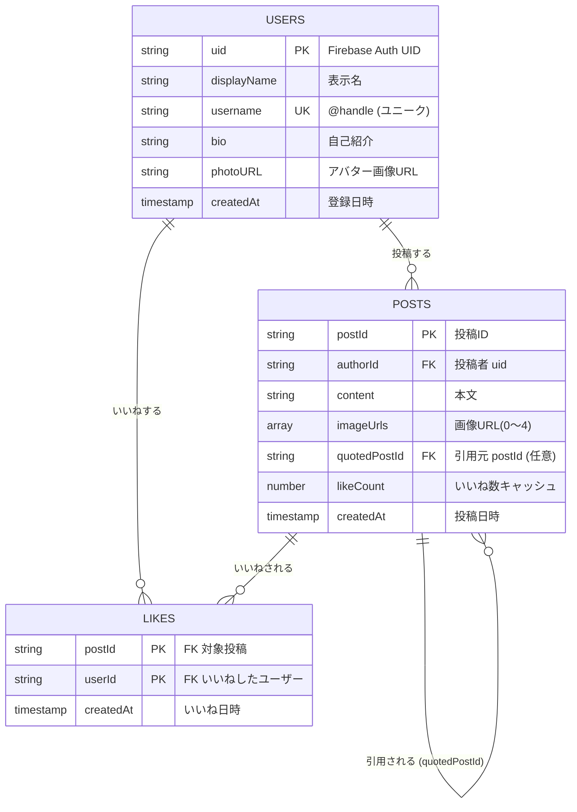

# SNSアプリ 要件定義書(X風)

作成日: 2026-05-06
バージョン: 0.1(初版・個人開発メモ)

---

## 1. プロジェクト概要

### 1.1 アプリ名(仮)
SNS-app(X風SNSアプリケーション)

### 1.2 目的・背景
X(旧Twitter)を参考にした短文投稿型のSNSアプリを、Next.js + Firebase で個人開発する。
本ドキュメントは自己整理を目的とした初版で、まずは中核となる6機能を実装し、その後 X の定番機能を段階的に追加していく。

### 1.3 ターゲットユーザー像
- 短文や画像で気軽に発信したい個人ユーザー
- 個人開発の学習対象として、本人および動作確認用ユーザー

---

## 2. 前提条件

### 2.1 技術スタック
| 区分 | 採用技術 |
|---|---|
| フロントエンド | **Next.js**(App Router 想定 / TypeScript) |
| バックエンド / BaaS | **Firebase** |
| 認証 | Firebase Authentication |
| データベース | Cloud Firestore |
| ファイルストレージ | Cloud Storage for Firebase |
| ホスティング | Firebase Hosting または Vercel(候補) |

### 2.2 ユーザー認証(前提)
本アプリの全機能は **ログイン済みユーザーのみ利用可能** とする(認証機能は前提扱いとし、本要件定義書では機能要件としては詳述しない)。

- 認証方式の候補: メール+パスワード / Googleログイン
- 未ログイン時はログイン画面へリダイレクト
- ログイン中ユーザーの情報は Firebase Authentication から取得し、Firestore の `users` ドキュメントと紐付ける

---

## 3. 機能要件

本リリースで実装する 6 機能。

### 3.1 投稿機能
**概要**: ユーザーがテキスト(任意で画像付き)を投稿し、タイムラインに表示する。

| 項目 | 内容 |
|---|---|
| 操作フロー | ① 投稿フォームを開く ② テキスト入力 ③ (任意)画像添付 ④ 「投稿」ボタンで送信 ⑤ タイムラインに即時反映 |
| 入力 | テキスト(必須)、画像(任意・3.6 参照) |
| 出力 | タイムライン上に新規投稿カードが追加 |
| バリデーション | 文字数上限: 280 文字(暫定)/ 空文字投稿不可 / 画像のみの投稿可否は要検討 |
| 制約 | ログイン必須 |

### 3.2 いいね機能
**概要**: 投稿に対して「いいね」を付与・解除でき、いいね数を表示する。

| 項目 | 内容 |
|---|---|
| 操作フロー | 投稿カードのハートアイコンをタップ → トグル動作(付与/解除) |
| 制約 | 1 ユーザー × 1 投稿につき 1 いいねまで |
| 表示 | 各投稿のいいね総数、自分がいいね済みかどうかの状態 |
| 自分の投稿 | 自分の投稿にもいいね可能とする(初版方針) |

### 3.3 削除機能
**概要**: 自分の投稿を削除する。

| 項目 | 内容 |
|---|---|
| 操作フロー | 投稿カードのメニュー → 「削除」 → 確認ダイアログ → 削除実行 |
| 権限 | **自分の投稿のみ削除可**(他人の投稿は削除不可) |
| 関連データ | 削除された投稿に紐づく いいね は連動して削除(または無効化) |
| 引用元との関係 | 引用元の投稿が削除された場合の引用ポスト側の表示は **3.5** で扱う |

### 3.4 プロフィール機能
**概要**: ユーザーごとのプロフィールを表示・編集する。

| 項目 | 内容 |
|---|---|
| プロフィール項目 | 表示名 / ユーザー名(@handle) / 自己紹介 / アバター画像 |
| 表示内容 | 上記項目 + そのユーザーの投稿一覧(新しい順) |
| 編集機能 | **自分のプロフィールのみ編集可** |
| 画面 | 自分のプロフィール / 他ユーザーのプロフィール / プロフィール編集 |

### 3.5 引用ポスト機能
**概要**: 既存の投稿を引用し、コメントを付けて新しい投稿として投稿する。

| 項目 | 内容 |
|---|---|
| 操作フロー | 投稿カードの「引用」ボタン → 投稿フォームに引用元が埋め込まれる → コメント入力 → 投稿 |
| 表示 | 引用ポストには元の投稿がカード形式で埋め込まれて表示される |
| 引用元削除時 | 元の投稿が削除されている場合、「この投稿は削除されました」と表示する |
| 多重引用 | 引用ポストをさらに引用するかは初版では **不可** とする(検討事項) |

### 3.6 画像投稿機能
**概要**: 投稿時に画像を添付する。

| 項目 | 内容 |
|---|---|
| 添付枚数 | 1 投稿あたり 最大 4 枚(暫定) |
| 対応形式 | JPEG / PNG / GIF / WebP |
| ファイルサイズ上限 | 1 ファイル 5MB 以下(暫定) |
| 保存先 | Cloud Storage for Firebase |
| 表示 | タイムライン・投稿詳細でグリッド表示、タップで拡大 |

---

## 4. データモデル(Firestore 概要)

初期段階のコレクション設計スケッチ。詳細は実装時に詰める。

### 4.0 ER図

Firestore はリレーショナルDBではないが、エンティティ間の関係を整理するため ER 図として表現する。

**関係の補足**
- `USERS` 1 — N `POSTS`: 1ユーザーは複数投稿を持つ(`POSTS.authorId` → `USERS.uid`)
- `USERS` 1 — N `LIKES` / `POSTS` 1 — N `LIKES`: いいねは「ユーザー × 投稿」の交差エンティティ。`(postId, userId)` の複合主キーで一意性を担保
- `POSTS` 自己参照(0..1 — N): 引用ポストは `quotedPostId` で元の投稿を指す。引用しない通常投稿では NULL

### 4.1 `users` コレクション
| フィールド | 型 | 説明 |
|---|---|---|
| `uid` | string | Firebase Auth の UID(ドキュメントID) |
| `displayName` | string | 表示名 |
| `username` | string | ユーザー名(@handle、ユニーク) |
| `bio` | string | 自己紹介 |
| `photoURL` | string | アバター画像URL |
| `createdAt` | timestamp | 登録日時 |

### 4.2 `posts` コレクション
| フィールド | 型 | 説明 |
|---|---|---|
| `postId` | string | ドキュメントID |
| `authorId` | string | 投稿者の uid |
| `content` | string | テキスト本文 |
| `imageUrls` | array<string> | 添付画像URL(0〜4) |
| `quotedPostId` | string \| null | 引用元の postId(引用ポストの場合のみ) |
| `likeCount` | number | いいね数(集計用キャッシュ) |
| `createdAt` | timestamp | 投稿日時 |

### 4.3 `likes` データ(設計案)
- 案A: トップレベル `likes` コレクション(`postId` + `userId` で一意)
- 案B: `posts/{postId}/likes/{userId}` のサブコレクション

→ どちらを採用するかは実装時に決定。

---

## 5. 画面一覧

| # | 画面 | 概要 |
|---|---|---|
| 1 | ログイン / サインアップ | 認証画面 |
| 2 | ホーム(タイムライン) | 投稿の一覧表示・新規投稿フォーム |
| 3 | 投稿詳細 | 1 投稿の詳細(引用元含む) |
| 4 | プロフィール | 自分/他ユーザーのプロフィール + 投稿一覧 |
| 5 | プロフィール編集 | 自分のプロフィールを編集 |

※ 投稿作成はモーダル方式 or 専用画面のどちらかを実装時に決定。

---

## 6. 非機能要件(簡易)

| 区分 | 内容 |
|---|---|
| レスポンシブ | PC・モバイル両対応(モバイルファースト) |
| セキュリティ | Firestore Security Rules / Storage Rules で「自分のリソースのみ書き込み・削除可」を担保 |
| パフォーマンス | タイムラインはページネーション or 無限スクロールで描画負荷を抑制 |
| アクセシビリティ | 画像には alt、ボタンには aria-label を最低限付与 |

---

## 7. 将来追加機能候補(本リリース対象外)

提出後に検討する候補機能。X の定番機能を中心に列挙。

- [ ] フォロー / フォロワー機能
- [ ] リプライ / スレッド表示
- [ ] リポスト(引用なしの単純リポスト)
- [ ] 検索(投稿・ユーザー・ハッシュタグ)
- [ ] 通知機能(いいね、引用、フォロー等)
- [ ] DM(ダイレクトメッセージ)
- [ ] ブックマーク
- [ ] 投稿の編集機能
- [ ] ミュート / ブロック
- [ ] トレンド表示
- [ ] 動画投稿
- [ ] ハッシュタグ・メンション

---

## 8. 未確定事項 / TODO

実装前に確定させたい項目:

- [ ] 文字数上限の確定(現在: 280 文字)
- [ ] 画像の最大枚数・最大サイズの確定(現在: 4 枚 / 5MB)
- [ ] 未ログインユーザーがタイムラインを閲覧可能とするか
- [ ] 認証方式の確定(メール+パスワード / Google / 両方)
- [ ] いいねデータの保持方式(案A or 案B)
- [ ] 画像のみの投稿(テキストなし)を許可するか
- [ ] ホスティング先(Firebase Hosting / Vercel)
